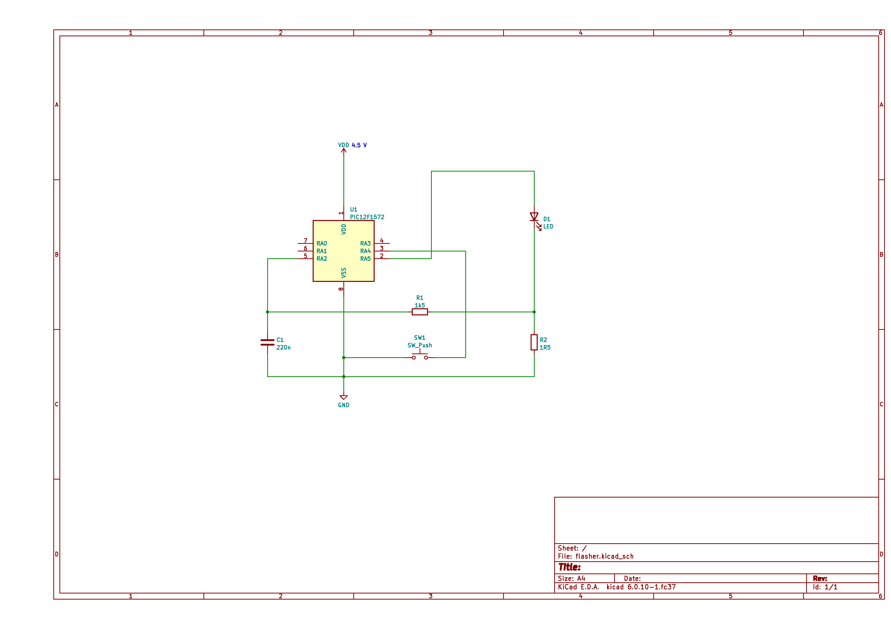

Description:
============

This is an attempt to replace the broken Chinese LED driver with the custom
design using PIC12F1572. It originally drove several LEDs built-in in the
hood (cap). There are three modes of operation (four if the "off" is also
counted as the mode) that are switched via the push button (active low):

| Mode | Description                  |
|------|------------------------------|
| 0    | off (stand-by)               |
| 1    | blink 80 ms on / 80 ms off   |
| 2    | blink 160 ms on / 160 ms off |
| 3    | constant on                  |

Power supply is 4.5 V (three 1.5 V coin cells). The average LED current drive
is cca. 20 mA. There is a constant current LED drive which fluctuates by
cca. 1 mA which is not visible by the naked eye. The idle power consumption is
very low (cca. 500 nA), thus it can stay in the stand-by (mode 0) on the coin
cells for several years. It drives the LED by the PWM and can tolerate slight
drop off of the supply voltage (battery discharge).

- [Schematic KiCad](https://github.com/yarda/flasher/blob/master/flasher.kicad_sch)
- [Schematic PDF](https://github.com/yarda/flasher/blob/master/flasher.pdf)

The feedback loop senses the voltage on the sensing resistor R2 through the
low pass HW filter R1, C1. The voltage is read by the ADC with the constant
voltage reference, thus the sensed voltage corresponds to the current.
The R1, C1 values aren't critical, I used what I had handy. The R1C1 time
constant I used is probably a bit overrated wich resulted in a slow
stabilization (de-stabilization) of the feedback loop (which is OK for the
flasher operated from batteries). Thus it may work correctly even with the
lower R1, C1 values.

There is currently no PCB design because the reference design was hacked onto
the original Chinese PCB (with the removed faulty Chinese ASIC). Feel free
to contribute one :).

The build was tested with the Microchip MPLAB X.

Hacking:
========

Currently it works as the step-down converter. It would be also interesting
improvement to add an inductor (and update the code) to allow it to work
as the step-up converter. In such case it should also keep the current
even if the battery is more discharged.

License:
========

Copyright (C) 2022 Yarda <zbox AT atlas.cz>

This program is free software: you can redistribute it and/or modify
it under the terms of the GNU General Public License as published by
the Free Software Foundation, either version 3 of the License, or
(at your option) any later version.

This program is distributed in the hope that it will be useful,
but WITHOUT ANY WARRANTY; without even the implied warranty of
MERCHANTABILITY or FITNESS FOR A PARTICULAR PURPOSE.  See the
GNU General Public License for more details.

You should have received a copy of the GNU General Public License
along with this program.  If not, see <http://www.gnu.org/licenses/>.

Full text of the license is enclosed in COPYING file.
